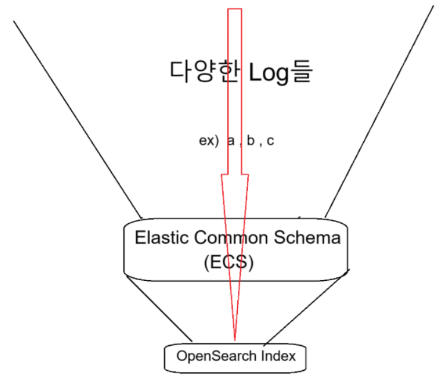

# Elastic Common Schema
* https://www.elastic.co/docs/reference/ecs
  * Elasticsearch에 로그 및 metric같은 이벤트 데이터를 저장할 때 사용되는 필드 집합을 정의   
(각 필드에 대한 필드 이름과 Elasticsearch 데이터 유형을 지정)
  * 이벤트 데이터를 정규화하여 
이벤트를 더욱 효과적으로 분석, 시각화하고 상관관계 분석할 수 있게 해줍니다
* fields.csv : 원본
  * fields_core.csv : core필드만 추출한거
    * fields_core_selected.csv : 필요한 칼럼들만 추출한거   

